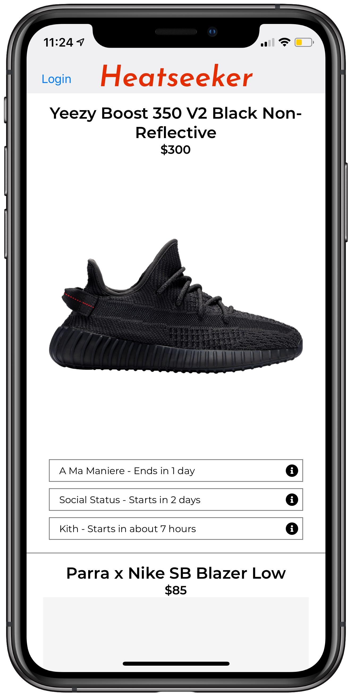

# The Problem

If you're a sneakerhead, you know how hard it can be to get the most hyped sneakers for retail price when they come out. The best chances to get them are through your local sneaker shops, who will often raffle off the opportunity to purchase limited release sneakers. The issue with this is that these stores only market their raffles via Instagram, and if you miss the post you could miss the raffle entirely.

# Solution

Enter Heatseeker - the ultimate sneakerhead companion. Heatseeker keeps track of all of the local raffles in your area, and will instantly notify you when a new raffle is posted. In addition, Heatseeker gives you the most important info at your fingertips to help you in your quest to acquire your "grails".

When a user opens heatseeker, they get a list of upcoming launches, and all nearby raffles for that sneaker. They can open the raffle card to view raffle insutructions, as well as get a direct link to the instagram post and a link to google maps to get directions to the store where the raffle is being held. 

# Technical Details

Heatseeker is a built in React Native using Expo and the backend is built using Node and Express and sits atop a PostgreSQL database.  

Users can create an account and login using Auth0 integration. When a user registers, the app asks the user for permission to send notifications, when accepted a notification token ID is saved to the user record in the Auth0 noSQL database. When new sneaker raffles are added to the database via the API, a notification is sent out to all users alerting them to the new entry. Also on account creation the app asks the user for permission to access their location data. Accepting this allows the user to view raffle entries in order of geographic distance. 
